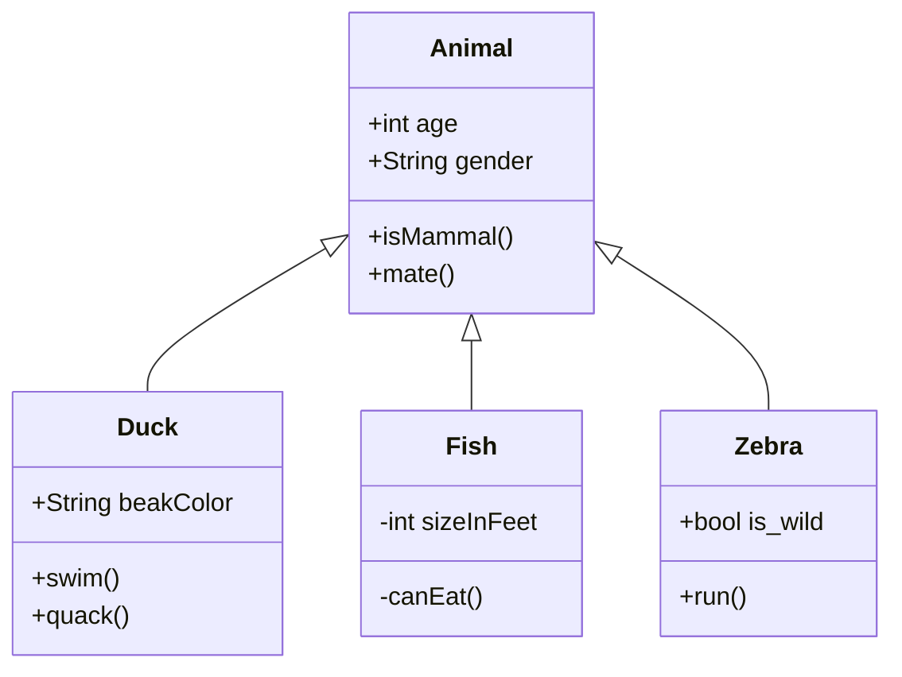

Traefik supports [client authentication (mTLS)](https://doc.traefik.io/traefik/https/tls/#client-authentication-mtls), allowing client certificates issued by a given CA to be required to connect to some services.

However, it does not support filtering only by a subset of Subject CNs (common names).

One could use multiple CAs, one per device/user or one per service, to have this granularity but it's not very practical for either management or configuration.

## TL; DR;

Use [traefik-commonname-validator-plugin](https://github.com/fopina/traefik-commonname-validator-plugin) middleware to solve this.

## Deets

