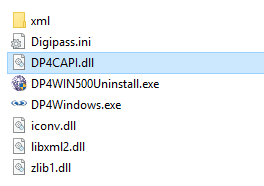
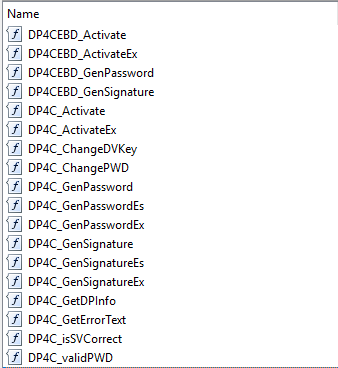
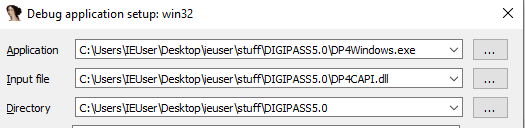
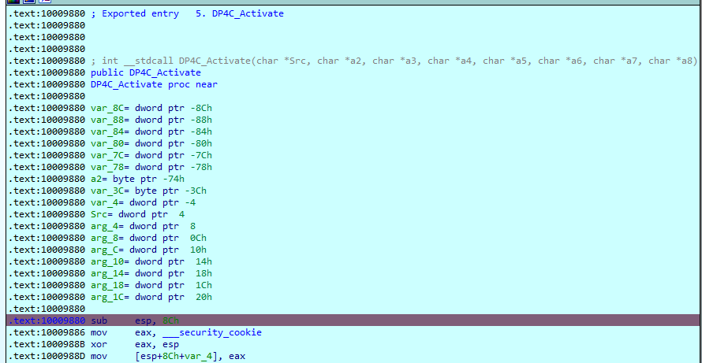
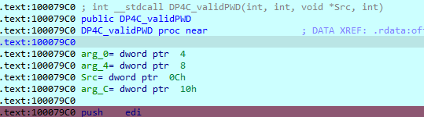
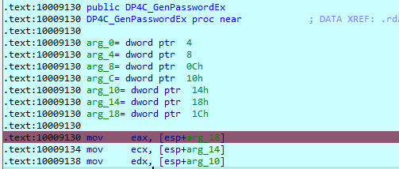

I was looking for some excuse to improve my ~~nil~~ *little* experience with IDA and building a CLI for [Vasco Digipass](https://www.onespan.com/support/security/product-life-cycle) came up in a conversation.

While keeping the OTP generator in the same machine where you use the OTP itself is unlikely to be endorsed by the security team, Vasco already provides that with `Digipass For Windows` (even if EOL is April 2022).

Challenged accepted, took a set of valid credentials[^1], the installer[^2] and fired up a brand new IDA VM.


## DLL

While I expected to start a long session of spamming F5 hoping IDA would give me pseudo-code easy enough to decipher, looking at the files in Digipass folder there was a `DP4CAPI.dll`



Let's load that DLL in IDA and check the exports



Interesting export names, let's see how they're used:

* Add a breakpoint on each of them: right click, add breakpoint
* Launch `DP4Windows.exe` from IDA: `Debugger` > `Process Options` and set `Application` to `DP4Windows.exe`



First prompt we get from the app is Profile URL with a default of http://sc.vasco.com/update/dp4windows/50/digipass.xml. Back to this one later.

Next one prompts for serial and activation and entering these brings us to the first breakpoint:



`*Activate`, makes sense. Thank you IDA for such a clear breakdown of the args as well!

8 args. Let's dump data for the last 8 items pushed to the stack (or 9 but skip the last as that's the ret address for the call)

```python
Python> arg_addrs = [
  idaapi.get_dword(idautils.cpu.esp+X*4)
  for X in range(1, 9)
]
Python> init_vals = [
  ida_bytes.get_bytes(X, 50)
  for X in arg_addrs
]

Python> for l in init_vals : print(l)

b'3806564553AEF4E69858FB1FA8165D51F7EA40293792D20F06'
b'*SERIAL\x00...'
b'**********ACTIVATION\x00...'
b'\xff\xff\xff...'
b'111111\x00\x00\x00\x00...'
b'\xff\xff\xff...'
b'\x00\x00\x00\x00...'
b'\x00\x00\x00\x00...'
```

Using the variable names assigned by IDA:

* `Src`: back to that [xml](http://sc.vasco.com/update/dp4windows/50/digipass.xml) from the start, this matches the `OfflineActivation` `StaticVector` value (confirmed by looking into a few more bytes)
* `a2`: serial number used (redacted)
* `a3`: activation code (redacted)
* `a4`: value in stack is 0
* `a5`: seems like a fixed value of `111111` (even with different credentials[^1])
* `a6`: value in stack is 0
* `a7`: output buffer?
* `a8`: output buffer?

Double click on current ESP value takes us to the return of the function, so we can add a breakpoint there (press `C` to convert to code if not decompiled).  
Then continue execution until it stops there. It does through other functions in the DLL but those were called by `*Activate`, not by the GUI.

If we look at the values of the args now (re-using the addresses we saved)

```python
[
  ida_bytes.get_bytes(X, 50)
  for X in arg_addrs
]
```

We can confirm `a7` and `a8` have been changed and I'll call them `ACTIVATION_KEY1` and `ACTIVATION_KEY2`. `EAX` value is `0`, that should be the expected success return code. 

Click continue and next stop: `*validPWD`



4 args, do the same:

```python
Python> arg_addrs = [
  idaapi.get_dword(idautils.cpu.esp+X*4)
  for X in range(1, 5)
]
Python> init_vals = [
  ida_bytes.get_bytes(X, 50)
  for X in arg_addrs
]

Python> for l in init_vals : print(l)

b'***ACTIVATION_KEY1'
b"***ACTIVATION_KEY2"
b'111111\x00\...'
b'\x00\x00\x00\x00...'
```

Last argument (at least) looks like output buffer. Again, break on return address, continue, dump.

Content did change, let's call it `VALID_TOKEN`. `EAX` value is `1`, so that should be the expected success return code.

Next stop, `DP4C_GenPasswordEx`.



```python
Python> arg_addrs = [
  idaapi.get_dword(idautils.cpu.esp+X*4)
  for X in range(1, 8)
]
Python> init_vals = [
  ida_bytes.get_bytes(X, 50)
  for X in arg_addrs
]

Python> for l in init_vals : print(l)
b'***ACTIVATION_KEY1'
b"***ACTIVATION_KEY2"
b'\xff\xff\xff\xff...'
b'***VALID_TOKEN'
b'\xff\xff\xff\xff...'
b'\x00\x00\x00\x00\x00...'
b'\x00\x00\x00\x00\x00...'
```

args 3 and 5 have value 0 and last two arguments look like output buffers. Break on ret, continue, dump.

`EAX` value is `0`, last argument was not changed (used only for errors?) but the one before has a six-digit OTP :trophy:

I've put this all to use in [dp4cli](https://github.com/fopina/dp4cli/tree/dllversion)

```shell
➜ dp4cli
120954
```

Next step will be to spam F5 on all these DLL functions, but it was an interesting first step (for me)!

[^1]: serial number and activation code
[^2]: even if distribution is restricted, it can be found online
